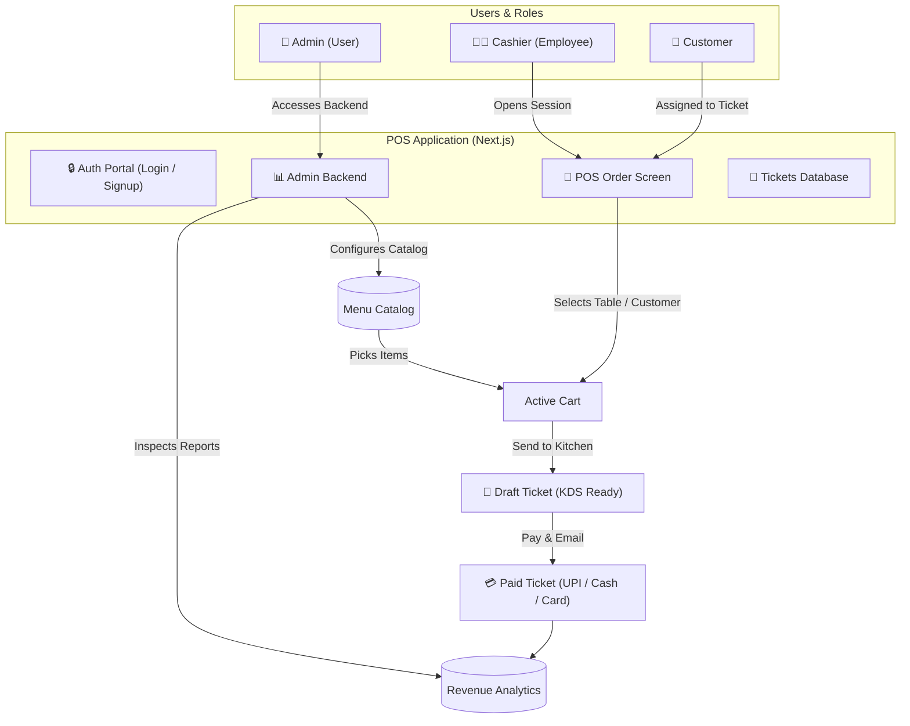
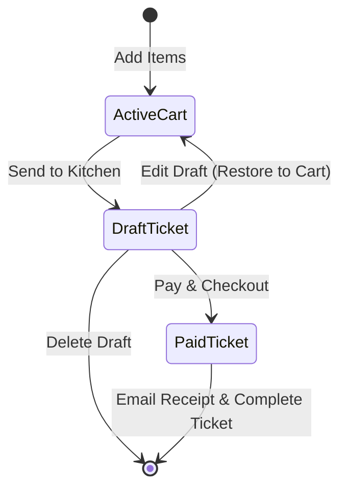

# ☕ Oak & Bean - Cafe Point of Sale (POS)

A high-performance, responsive, and aesthetically premium web-based Restaurant Point-of-Sale (POS) terminal and backend dashboard designed for cafe and diner operations. Built on a modern **Next.js** framework with a custom, cozy paper-and-wood theme, it offers a seamless interface for cashiers to manage tables and orders, alongside a robust administrative panel for analytics and menu configuration.

---

## 📖 Table of Contents
1. [Project Overview](#-project-overview)
2. [Flow & Architecture](#-flow--architecture)
3. [Core Features](#-core-features)
4. [Visual Design System](#-visual-design-system)
5. [Directory Structure](#-directory-structure)
6. [Getting Started](#-getting-started)
7. [Test Automation Support](#-test-automation-support)

---

## 🌟 Project Overview

**Oak & Bean** is designed to streamline daily cafe logistics by connecting front-of-house customer transactions with administrative reports. 
The application implements a split system:
- **POS Terminal (Cashier View):** A high-touch, drag-and-drop-friendly interface allowing staff to select dining tables, assign customers, construct orders with instant tax calculations, send tickets to the kitchen, and complete split checkouts.
- **Backend Dashboard (Admin View):** A clean dashboard presenting revenue graphs, payment method distributions (UPI, Cash, Card), search-filtered order receipts, and live menu catalog overrides.

---

## 🔄 Flow & Architecture

### System Topology & Roles
The diagram below outlines the relationship between the three main roles (**Admin**, **Cashier**, and **Customer**) and the core interface components:



### Ticket State Machine
Orders transition through standard lifecycle states to ensure cashiers can hold tables or modify orders before payment:



---

## 🛠️ Core Features

### 1. Staff Authentication & Portal
- **Role-based routing:** Automatic view adjustment based on login roles. Cashiers enter the POS, while Admins land on the backend reporting view.
- **Quick-Access Demo Accounts:** In-app access toggles for quick testing (`admin@oakandbean.com` and `employee@oakandbean.com`).
- **Full Signup Flow:** Allows new staff registration with selectable Admin or Employee authorization levels.

### 2. Interactive POS Terminal
- **Dynamic Category Tabs:** Instantly filters products by Beverages, Pastries, Milkshakes, Burgers, or Sides.
- **Live Search:** Fast global fuzzy match on product names across all categories.
- **Overlays & Dropdowns:** Click-outside-to-close modals for Customer assignment and Table selection (Table 1 through 12).
- **Fluid Grid Design:** High-contrast item cards with clean typography and layout adapt smoothly from small tablets to desktop screens.

### 3. Active Order Ledger (Cart)
- **Subtotal & Tax Calculations:** Automated 5.0% flat sales tax rate calculations updated with zero latency.
- **Quantity Adjustments:** Simple `+` and `-` controls for each item, auto-evicting items when count falls to zero.
- **KDS Dispatching:** Sends order tickets into the database in `Draft` status, freeing the terminal for the next customer.

### 4. Ticket & Bill Management
- **Searchable Database:** Cashiers and Admins can query orders by Order ID, table number, or customer name.
- **Interactive Receipts:** Full breakdown of items, quantities, subtotal, taxes, applied payment method, and email status.
- **Draft Restoration:** Clicking "Edit Draft" loads the ticket back into the active cart and frees up the table, ensuring order flexibility.
- **Digital Invoicing:** Prompts for receipt email on payment validation and updates the ticket data.

### 5. Admin Analytics & Configurator
- **Live Performance Dashboard:** Total revenue (paid tickets), unpaid liability (drafts), and ticket counts.
- **Payment Method Splitter:** Visual percentage bar showing transaction values processed via UPI, Cash, and Card.
- **Catalog Manager:** Form to add new menu items (Name, Price, Category) and interactive controls to update prices or delete active products.

---

## 🎨 Visual Design System

The app utilizes a warm, organic visual palette inspired by cozy, high-end paper menus and polished timber fittings. No styling frameworks (like Tailwind) are used, ensuring maximum customization and stability.

| Category | Token Name | Hex Value | Semantic Meaning |
|---|---|---|---|
| **Base** | `--bg-dark` | `#FAF8F5` | Warm, textured paper background |
| **Panel** | `--bg-panel` | `#FFFFFF` | Clean white panel dividers |
| **Accent 1** | `--neon-cyan` | `#8C6239` | Polished Oak / Teak brown |
| **Accent 2** | `--neon-pink` | `#C15C3D` | Terracotta / Brick highlight |
| **Accent 3** | `--neon-orange` | `#C2915C` | Golden Oak tone |
| **Accent 4** | `--neon-green` | `#5E806D` | Cozy Sage Green |
| **Text** | `--text-primary` | `#2E1F15` | Dark walnut espresso |

### Key UI Enhancements
- **Glassmorphic Overlays:** Dialog boxes feature a clean frosted effect with sand-colored thin borders (`rgba(140, 98, 57, 0.12)`).
- **Responsive Flex Columns:** Dual-column splits collapse into swipeable mobile navigation tabs (Menu ↔ Cart / Tickets ↔ Receipt) for hand-held terminal compatibility.
- **Outfit Typography:** Styled with the Google Fonts `Outfit` family, offering geometric, clean-cut, premium readability.

---

## 📁 Directory Structure

```text
Odoo-POS/
├── jsconfig.json            # Import path mappings (@/* -> src/*)
├── next.config.mjs          # Next.js configurations
├── eslint.config.mjs        # Linters and standards
├── package.json             # Scripts & dependency definitions
├── Cafe POS Hackthon.excalidraw   # UI mockups and design drafts
├── Odoo Cafe POS.pdf        # Requirement sheet & design system specs
└── src/
    ├── app/
    │   ├── favicon.ico
    │   ├── globals.css      # Design tokens, variables, custom scrollbars
    │   ├── layout.js        # Global wrapper
    │   ├── page.js          # Core POS state machine & layout splits
    │   └── page.module.css  # Component layouts, grids, flex partitions
    ├── components/
    │   ├── TopBar/          # Header, Search, Profile, Overlays
    │   ├── CategoryTabs/    # Catalog category filtration buttons
    │   ├── ProductGrid/     # Grid container for active menu cards
    │   └── CartPanel/       # Active ledger, calculations, payment triggers
    └── data/
        └── mockData.js      # Mock datasets (products, categories, tables)
```

---

## 🚀 Getting Started

### Prerequisites
- Node.js (v18.x or higher)
- npm (v10.x or higher)

### Setup Instructions
1. **Clone and Navigate:**
   ```bash
   cd Odoo-POS
   ```

2. **Install Dependencies:**
   ```bash
   npm install
   ```

3. **Run the Development Server:**
   ```bash
   npm run dev
   ```
   Open [http://localhost:3000](http://localhost:3000) in your browser to inspect the application.

4. **Production Build & Start:**
   ```bash
   npm run build
   npm run start
   ```

5. **Linting Check:**
   ```bash
   npm run lint
   ```

---

## 🤖 Test Automation Support

To facilitate integration and automated testing without blocking alerts or prompt dialogues:
1. Append `?test=true` to your browser URL (e.g., `http://localhost:3000/?test=true`).
2. This activates non-blocking mock inputs for dialogues:
   - `window.prompt` will automatically return `customer@example.com` and log to the console.
   - `window.alert` will record notifications directly to console logs without stalling thread execution.
